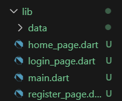
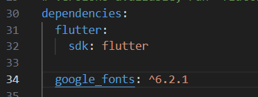
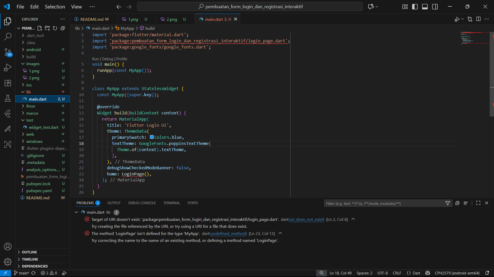
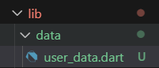
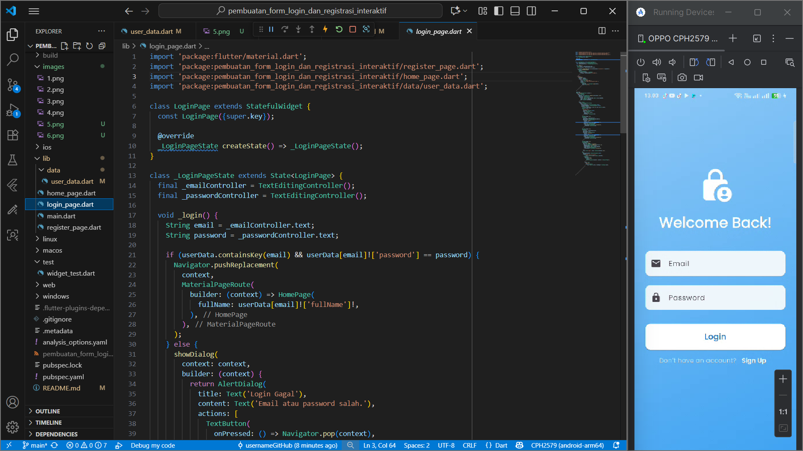
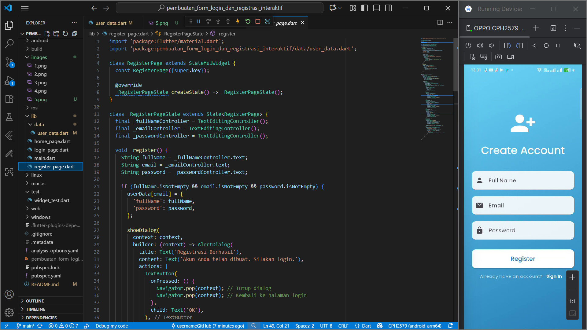
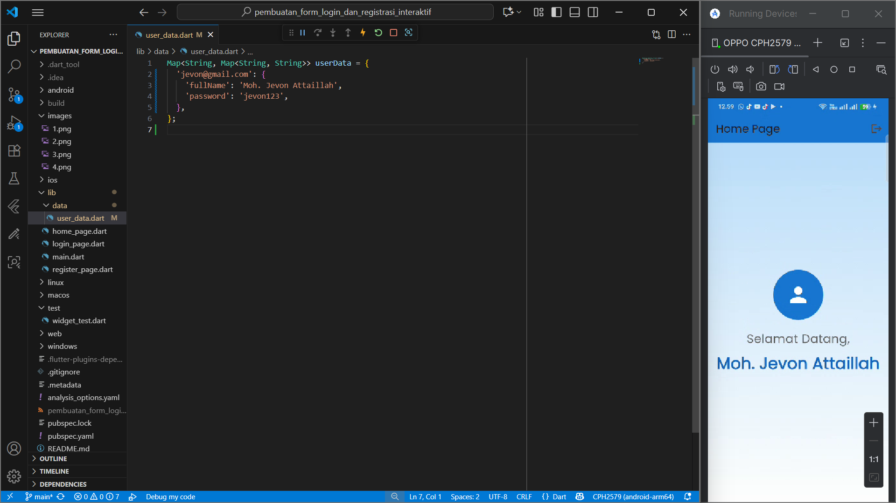

# Laporan Praktikum Pemrograman Perangkat Bergerak
**Nama**  : Moh. Jevon Attaillah  
**NIM**   : 362458302035  
**Kelas** : TRPL 2D  

---

# Pembuatan Form Login dan Registrasi Interaktif dengan Flutter 

## 1. Pendahuluan
Pemrograman perangkat bergerak merupakan salah satu bidang yang berkembang pesat seiring meningkatnya kebutuhan aplikasi mobile.  
Pada praktikum ini, mahasiswa mempelajari cara membuat aplikasi **Login dan Registrasi** menggunakan framework Flutter.  
Fokus utama adalah pada pembuatan **UI (User Interface)**, pengelolaan **input pengguna**, serta navigasi antar halaman.

### Tujuan Pembelajaran
- Merancang dan membuat layout halaman Login dan Registrasi.  
- Menggunakan widget dasar Flutter seperti `Scaffold`, `Column`, `TextField`, dan `ElevatedButton`.  
- Mengimplementasikan navigasi antar halaman menggunakan `Navigator`.  
- Mengelola state sederhana dan menyimpan data input pengguna.  
- Memahami event handling seperti aksi tombol login/registrasi.  

### Alat yang Dibutuhkan
- Flutter SDK  
- Android Studio / VS Code (dengan ekstensi Flutter)  
- Emulator Android/iOS atau perangkat fisik  

---

## 2. Desain dan Konsep Layout (Wireframe)

### Wireframe Halaman Login
- Ikon user lock  
- Judul **Welcome Back!**  
- Input: Email & Password  
- Tombol Login  
- Link ke halaman Registrasi  

### Wireframe Halaman Registrasi
- Ikon add user  
- Judul **Create Account**  
- Input: Full Name, Email, Password  
- Tombol Register  
- Link kembali ke halaman Login  

---

## 3. Implementasi Kode Flutter

### Struktur Proyek

### 3.1 main.dart
File utama aplikasi sebagai entry point. Mengatur tema, text theme, dan halaman awal **LoginPage**.



Masih error karna login masih belum dibuat.



Menambahkan kode berikut di yaml
### 3.2 user_data.dart

Setelah membuat kode pada main.dart, langkah berikutnya adalah membuat file user_data.dart di dalam folder data yang berada di bawah direktori lib. File ini berfungsi sebagai “database” sementara, di mana data pengguna disimpan menggunakan struktur `Map<String, Map<String, String>>` yang berisi `fullName`, `email`, dan `password`.



### 3.3 register_page.dart
Halaman registrasi akun baru dengan input: **Full Name, Email, Password**.  
Jika berhasil, data disimpan ke `userData` dan muncul dialog **Registrasi Berhasil**. Jika gagal, muncul dialog peringatan.

### 3.4 login_page.dart
Halaman login dengan input: **Email & Password**.  
Jika data sesuai dengan `userData`, pengguna diarahkan ke **HomePage**. Jika salah, ditampilkan dialog **Login Gagal**.

### 3.5 home_page.dart
Halaman setelah login berhasil. Menampilkan:
- Foto profil (ikon lingkaran)  
- Teks sambutan **Selamat Datang, {Nama User}**  
- Tombol Logout untuk kembali ke halaman Login.  

---

## 4. Kesimpulan dan Latihan Tambahan

### Poin Pembelajaran
- Membuat antarmuka aplikasi menggunakan widget dasar Flutter.  
- Mengelola input dengan `TextEditingController`.  
- Navigasi antar halaman dengan `Navigator.push`, `Navigator.pop`, dan `Navigator.pushReplacement`.  
- Mengirim data antar halaman melalui constructor.  
- Menyimpan data sementara dalam variabel global.  

### Latihan Pengembangan
1. **Validasi Input**: Tambahkan pengecekan format email (mengandung `@`) dan password minimal 6 karakter. 

### Perbaikan Validasi Registrasi

Pada bagian ini saya melakukan perbaikan kode pada halaman **Register**. Sebelumnya, validasi hanya mengecek apakah kolom sudah diisi atau belum. Setelah diperbaiki, saya menambahkan validasi yang lebih ketat supaya data yang masuk sesuai dengan aturan yang diharapkan.  

Beberapa perubahan yang saya lakukan yaitu:  
1. Menambahkan fungsi `_showErrorDialog()` agar pesan kesalahan bisa ditampilkan lebih rapi dan terpusat.  
2. Menggunakan `.trim()` pada input untuk menghapus spasi berlebih.  
3. Menambahkan validasi format email yang harus mengandung karakter `@`.  
4. Menambahkan validasi panjang password minimal 6 karakter.  

Dengan perbaikan ini, pengguna mendapat informasi yang lebih jelas saat melakukan kesalahan input, dan kode juga menjadi lebih terorganisir serta mudah dipelihara.


---

### Kode yang di-upgrade

Berikut adalah beberapa bagian kode yang diubah untuk menerapkan validasi yang lebih baik:

Kode sebelum hanya memeriksa apakah kolom kosong
```
void _register() {
  String fullName = _fullNameController.text;
  String email = _emailController.text;
  String password = _passwordController.text;
  if (fullName.isNotEmpty && email.isNotEmpty && password.isNotEmpty) {
    // ... logika registrasi
  } else {
    showDialog(
      // ... pesan error
    );
  }
}
```
Kode sesudah sudah ada validasi email & password
```
void _register() {
  String fullName = _fullNameController.text.trim();
  String email = _emailController.text.trim();
  String password = _passwordController.text.trim();

  // Memeriksa apakah ada kolom yang kosong
  if (fullName.isEmpty || email.isEmpty || password.isEmpty) {
    _showErrorDialog('Harap isi semua kolom.');
    return;
  }

  // Memeriksa format email
  if (!email.contains('@')) {
    _showErrorDialog('Format email tidak valid.');
    return;
  }

  // Memeriksa panjang password
  if (password.length < 6) {
    _showErrorDialog('Password minimal 6 karakter.');
    return;
  }

  // ... logika registrasi jika semua validasi lolos
}

// Fungsi pembantu untuk menampilkan dialog kesalahan
void _showErrorDialog(String message) {
  showDialog(
    context: context,
    builder: (context) => AlertDialog(
      title: const Text('Error'),
      content: Text(message),
      actions: [
        TextButton(
          onPressed: () => Navigator.pop(context),
          child: const Text('OK'),
        ),
      ],
    ),
  );
}
```
2. **Tampilkan/Sembunyikan Password**: Tambahkan ikon mata (`Icons.visibility`) untuk toggle password.

### Latihan 2 – Fitur Tampilkan/Sembunyikan Password

Pada latihan ini saya menambahkan fitur untuk menampilkan dan menyembunyikan password di halaman **Register** dan **Login**. Tujuan dari perbaikan ini adalah memberikan kenyamanan bagi pengguna ketika ingin memastikan password yang diketik sudah benar.  

Untuk menerapkan fitur ini, saya menambahkan sebuah variabel `bool` bernama `_obscurePassword` yang berfungsi sebagai penanda apakah password sedang dalam kondisi tersembunyi atau terlihat. Variabel ini kemudian dihubungkan dengan properti `obscureText` pada `TextField`.  

Selain itu, saya juga menambahkan widget `suffixIcon` berupa **IconButton**. Saat ikon ditekan, nilai `_obscurePassword` akan berubah dengan menggunakan `setState()`, sehingga tampilan password bisa ditampilkan atau disembunyikan sesuai kebutuhan pengguna.  

Contoh kode yang ditambahkan:  

```dart
bool _obscurePassword = true; // nilai awal: password disembunyikan

TextField(
  controller: _passwordController,
  obscureText: _obscurePassword,
  decoration: InputDecoration(
    hintText: 'Password',
    prefixIcon: const Icon(Icons.lock),
    border: OutlineInputBorder(
      borderRadius: BorderRadius.circular(12),
      borderSide: BorderSide.none,
    ),
    suffixIcon: IconButton(
      icon: Icon(
        _obscurePassword ? Icons.visibility : Icons.visibility_off,
      ),
      onPressed: () {
        setState(() {
          _obscurePassword = !_obscurePassword;
        });
      },
    ),
  ),
),
```
3. **Animasi Hero Widget**: Tambahkan efek transisi pada ikon di halaman login dan registrasi.  
4. **Shared Preferences**: Simpan status login agar pengguna tidak perlu login ulang saat aplikasi dibuka kembali.  

---

## 5. Dokumentasi
📸 Tambahkan screenshot hasil running aplikasi, misalnya:  
- Halaman Login  

- Halaman Registrasi  

- Halaman Home setelah login


---


